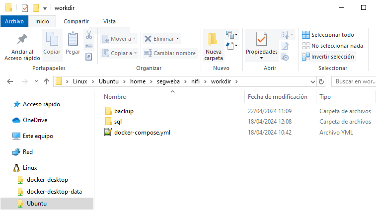

# Práctica en GitHub
   ```
   https://github.com/segweba/practica_nifi.git
   ```

# Descripción general de la práctica

- El flujo NiFi tiene como objetivo conectar con la web https://www.aishub.net para descargar mensajes AIS (https://es.wikipedia.org/wiki/Sistema_de_Identificación_Automática) y volcarlos en base de datos. Los datos descargados también se guardan en un fichero local a modo de backup.

# Particularidades

- La web proporciona un único fichero de muestra: https://www.aishub.net/downloads/nmea-sample.zip.
- Los datos AIS se pueden enviar por diferentes canales. En el flujo NiFi se incluye un proceso que segrega los mensajes tres grupos: los enviados por el canal A, los enviados por el canal B y el resto de mensajes.


# Consideraciones previas - Requisitos

- Se requiere usar el fichero yml proporcionado por el ponente:
   ```
   https://github.com/ulisesojeda/master_docs/blob/master/nifi/docker-compose.yml
   ```

- Se requiere crear la estructura dentro del directorio de trabajo:
   - docker-compose.yml: Fichero para levantar los contenedores necesarios.
   - sql: Carpeta donde incluir el fichero sql de creación de tablas en base de datos.
   - backup: Carpeta donde se guardará una copia de la información descargada de la URL. (opcional, ya que se crea en caso de no exitir)

   

# Descripción del flujo

- **Create_Table**: Crea, si no existen, las tablas necesarias para almacenar los mensajes AIS.

- **Collect_Data_from_URL**: Conecta con la página proveedora de datos AIS.

- **Unpack_ZIP_File**: Descomprime el fichero descargado desde el proveedor.

- **UpdateAttribute**: Incluye la fecha y hora en el nombre del fichero descargado.

- **Save_Backup**: Guarda una copia del fichero descargado en local

- **Split_in_Lines**: Descompone la información para procesarla línea a línea.

- **ReplaceText**: Incluye una línea con el nombre de cada uno de los campos (necesario para la inserción en base de datos).

- **RouteOnContent**: Separa los mensajes AIS por canal de emisión.

- **Put_Database_Channel_X**: Guarda en base de datos los mensajes procesados en la tabla correspondiente.


# Manual de uso

1. Entrar en Registry:
   ```
   http://localhost:18080/nifi-registry/#/explorer/grid-list
   ```

2. Crear un nuevo Bucket e impotar el fichero "nifi_practica_evaluacion_AJ.json" con el flujo NiFi creado.

3. Abrir NiFi:
   ```
   https://localhost:8443/nifi/
   Credenciales: admin/admin123456789   
   ```

4. En el menu superior, arrastrar a la zona de trabajo en icono de "Import from Registry".

5. Seleccionar el bucket creado en el punto 2 y seleccionar la verion más reciente del flujo NiFi.

6. Entra en el grupo de trabajo importado para visualizar el flujo NiFi.

7. Todos los procesos pueden estar arrancados salvo "Create_Table" y "Collect_Data_from_URL", que se ejecutarán con "Run Once".

8. Para comprobar que se ha efectuado una copia de seguridad de los mensajes recibidos:

   - Ir a la ruta ...\workdir\backup

9. Para comprobar que los mensajes han sido almacenados en las tablas correctas:

   - Entrar en el contenedor donde se encuentra la base de datos Postgres
   
   - Ejecutar: 
      ```
      psql -U postgres
      ```
   
   - Ver las tablas que hay en base de datos:
      ```
      select * FROM pg_catalog.pg_tables;
      ```

   - Consultar datos en tablas (por ejemplo, los 100 primeros registros):
      ```
      select * from channel_a limit 100;
	   select * from channel_b limit 100;
	   select * from channel_others limit 100;
      ```

   - Para borrar los registros de la tabla o la tabla completa [Opcional, se pone el ejemplo de la tabla "channel_a"]:
      ```
      delete from channel_a;
      drop table channel_a;
      ```

   - Para salir de base de datos:
      ```
      exit
      ```